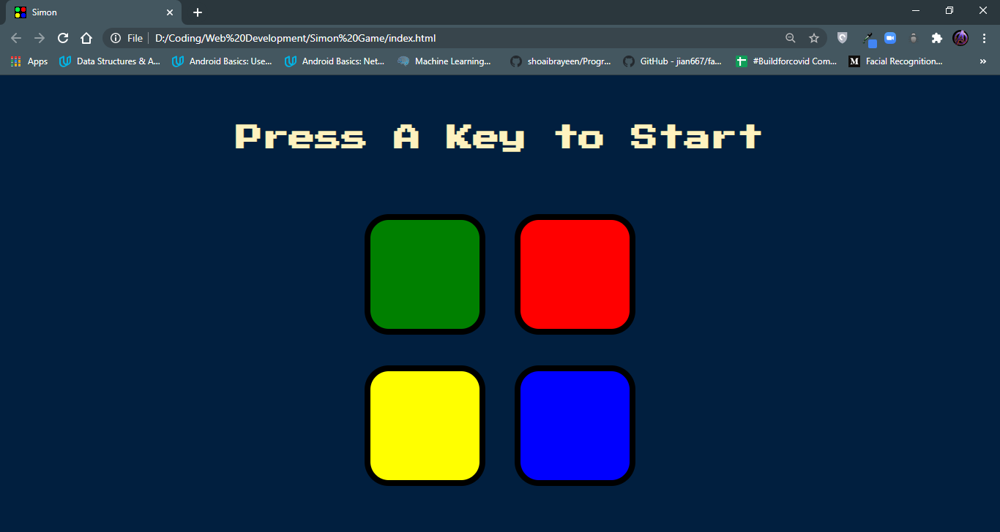
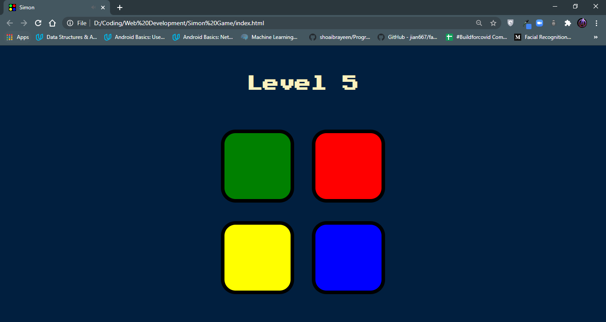
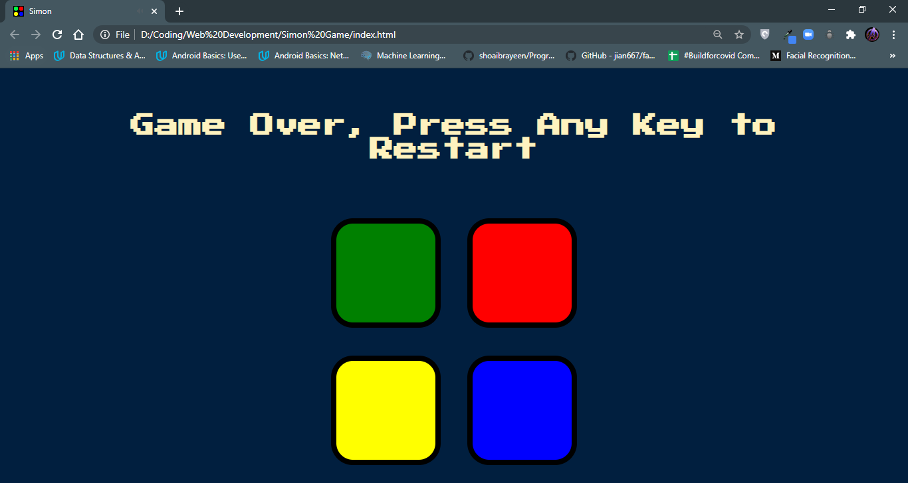

# Simon-Game
This is another project in The Complete Web Development 2020 Bootcamp course from Angela Yu.

The webapp focuses on implementing the popular simon game by using HTML,CSS,JS,Bootstrap and JQuery.

The project is used to practice advanced DOM, JS, Click Events, JQuery principles and concepts.

## Snapshots:
### Starter Image-

### During Game Image-

### Game Over Image-

## Inspiration:
The inspiration for the websites have been taken from the follwing:
* [Angela Yu](https://github.com/angelabauer)'s Complete Web Development Bootcamp Course on Udemy.

## Acknowledgements:
I'd like to express my greatest gratitude towards Angela Yu for her amazing teaching efforts and course.
For the website I've used the following resources:
* ***Icons***: [FlatIcons](https://www.flaticon.com/)
* ***Fonts***: [GoogleFonts](https://fonts.google.com/)
* ***Bootstrap***: [Bootstrap](https://getbootstrap.com/)